#  Mini Jira

A modern **Project Management System** inspired by Jira, built using **HTML, CSS, JavaScript, Node.js, Express.js, and MongoDB**. It helps teams create projects, manage tasks, track progress, and monitor deadlines through an interactive dashboard.

##  Features

###  Authentication
- User Registration
- User Login
- Forgot Password
- User Profile
- Logout

###  Dashboard
- Total Projects
- Total Tasks
- Open Tasks
- In Progress Tasks
- Completed Tasks
- Overdue Tasks
- Bar Chart
- Doughnut Chart
- Recent Projects
- Upcoming Tasks
- Recent Activity
- Notifications
- Interactive Calendar

###  Project Management
- Create Project
- Edit Project
- Delete Project
- Archive Project
- Restore Project
- Search Projects
- Filter by Status
- View Project Tasks

###  Task Management
- Create Task
- Edit Task
- Delete Task
- Assign Tasks
- Task Priority
- Task Status
- Due Date
- Attach Files
- Comments
- Search Tasks

###  Kanban Board
- Open Tasks
- In Progress Tasks
- Completed Tasks
- Drag-and-Drop Style Layout

###  Calendar
- Monthly Calendar
- Task Due Date Indicators
- Previous / Next Month Navigation
- Task Dots on Calendar

### Reports
- Task Statistics
- Project Statistics
- Charts
- Progress Overview

###  Notifications
- Project Created
- Project Updated
- Project Deleted
- Project Archived
- Project Restored
- Task Created
- Task Updated
- Task Deleted

#  Technologies Used

## Frontend
- HTML5
- CSS3
- JavaScript
- Font Awesome
- Chart.js

## Backend
- Node.js
- Express.js
- MongoDB
- Mongoose

#  Project Structure

mini-jira
│
├── backend
│   ├── models
│   ├── uploads
│   ├── server.js
│   └── package.json
│
├── frontend
│   ├── dashboard
│   ├── project
│   ├── task
│   ├── kanban
│   ├── calendar
│   ├── report
│   ├── profile
│   ├── login
│   ├── register
│   ├── forgot-password
│   └── assets
│
└── README.md

#  Installation

## Clone Repository

bash
git clone https://github.com/kandhijayasree/mini-jira.git

Go to the project:

bash
cd mini-jira

## Backend Setup

Go to backend folder:

bash
cd backend

Install packages:

bash
npm install

Start server:

bash
node server.js

Server runs at:

http://localhost:3000

## Database

MongoDB

Database:

minijira

Connection:

javascript
mongodb://127.0.0.1:27017/minijira

## Frontend

Open

frontend/login.html

using **Live Server**.

# Screenshots
## Home Page

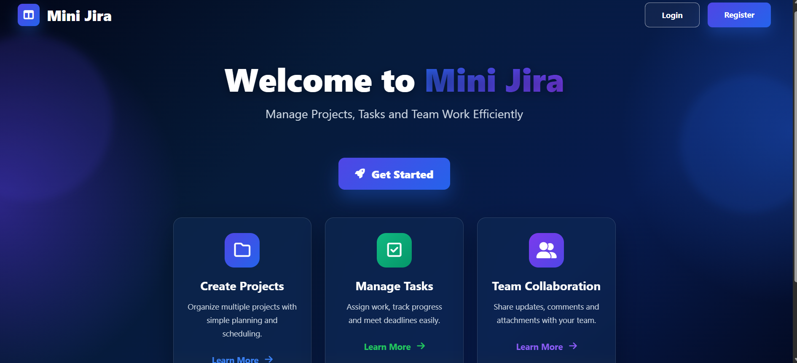
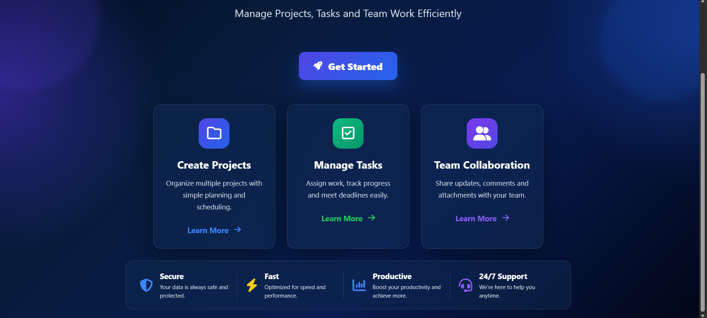

## Login Page

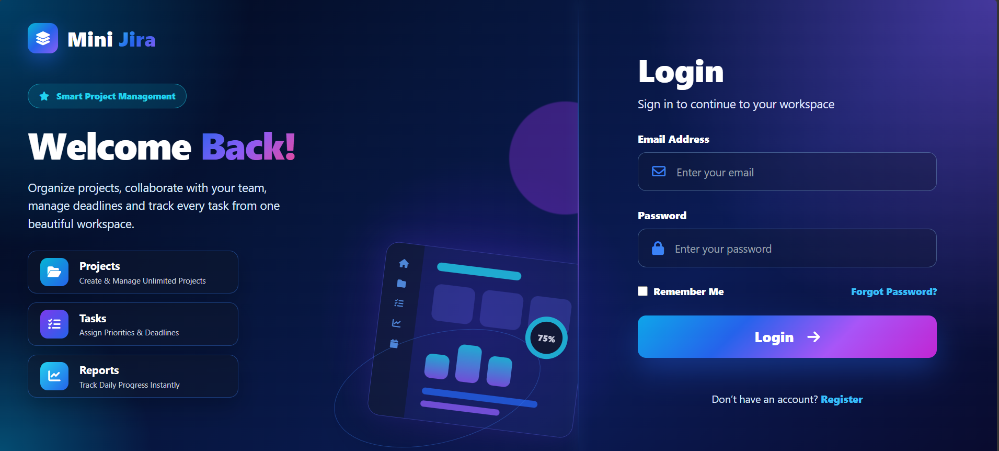

## Register Page

## Dashboard

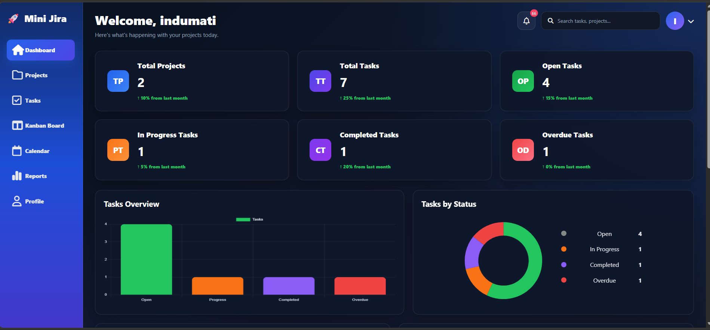
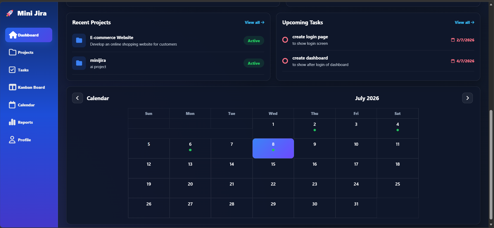

## Projects

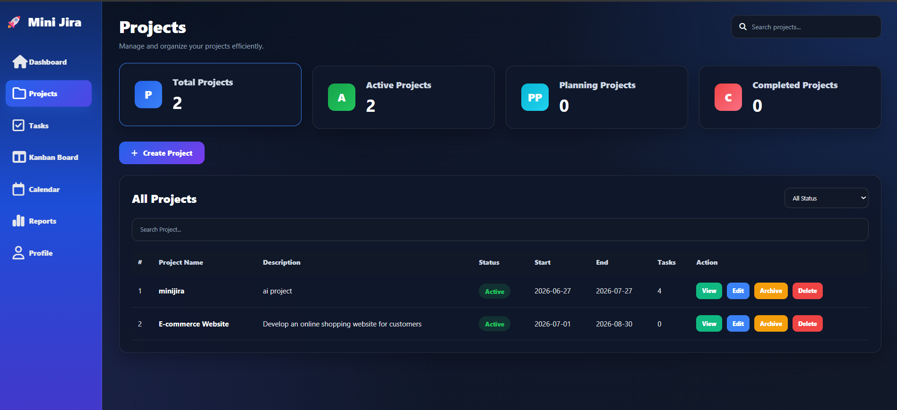

## Tasks

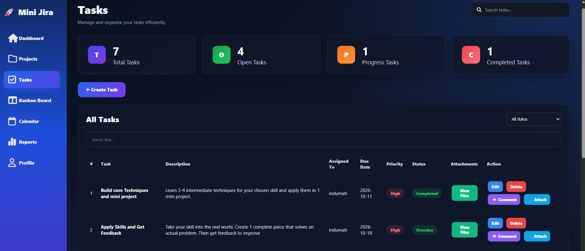
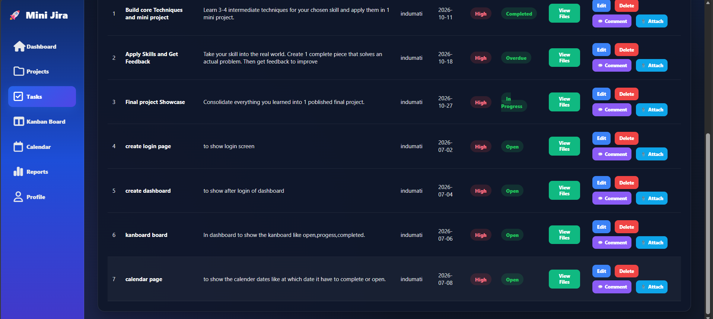

## Kanban Board

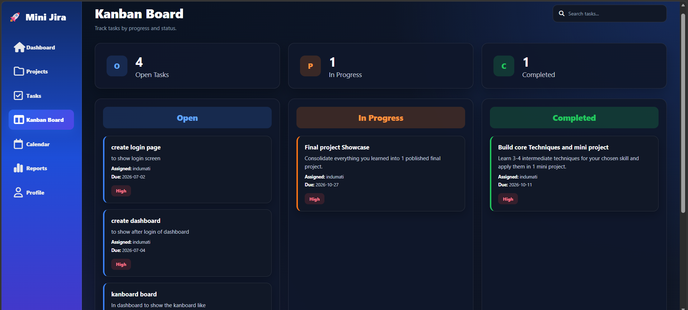
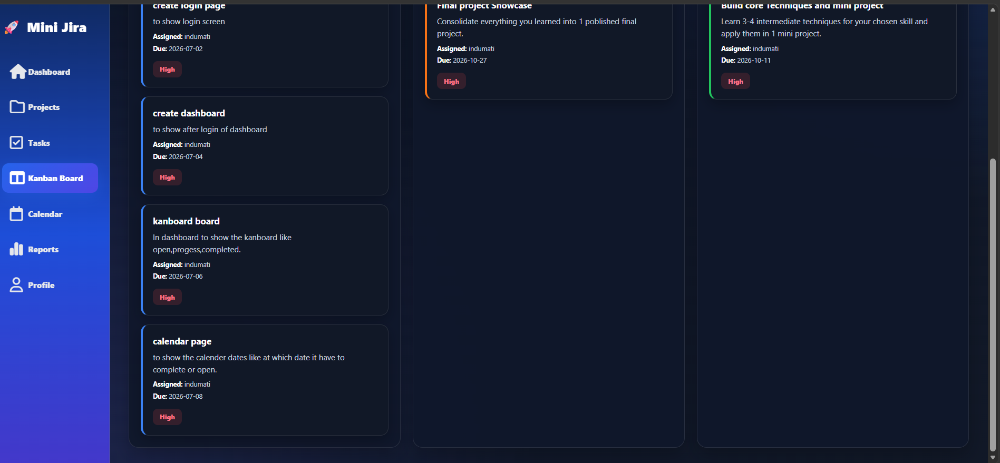
## Calendar

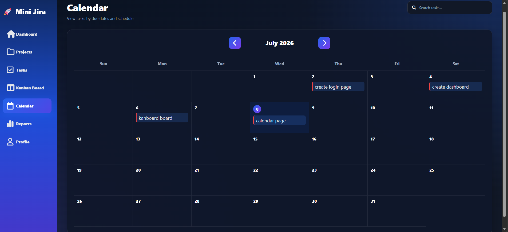

## Reports

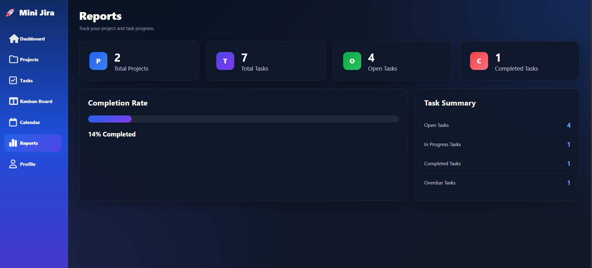

## Profile

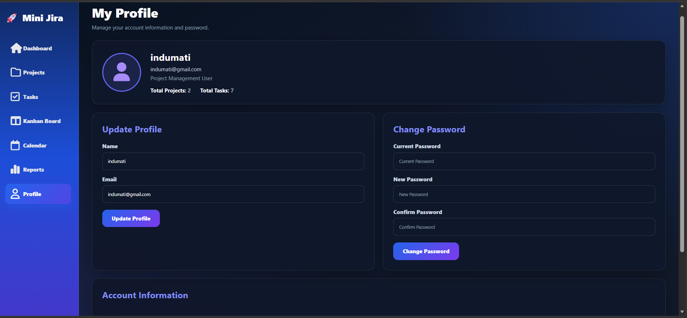
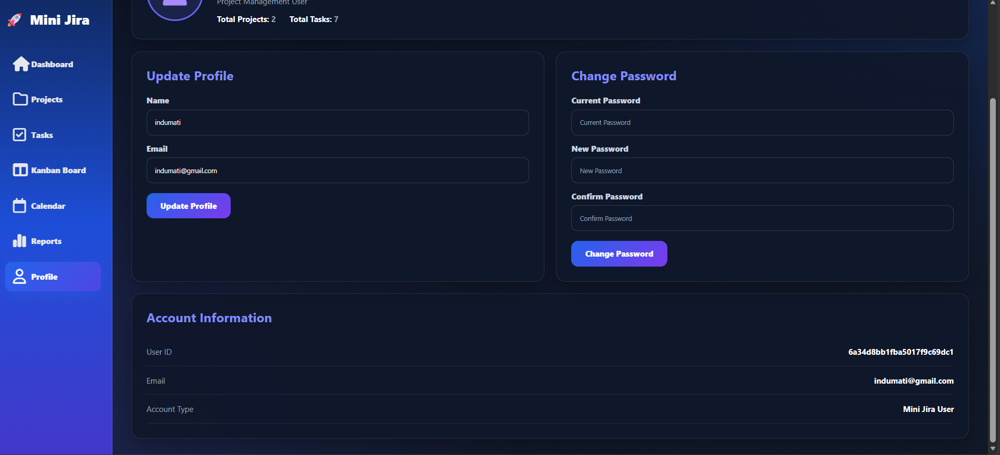

#  Future Improvements

- Email Notifications
- JWT Authentication
- Role Based Access
- Dark / Light Theme
- Team Collaboration
- Real-Time Updates using Socket.io
- Dashboard Analytics
- Export Reports (PDF / Excel)
- Mobile Responsive Design

#  Author

**Jayasree Kandhi**

GitHub:

https://github.com/kandhijayasree

#  If you like this project

Please give it a  on GitHub.
